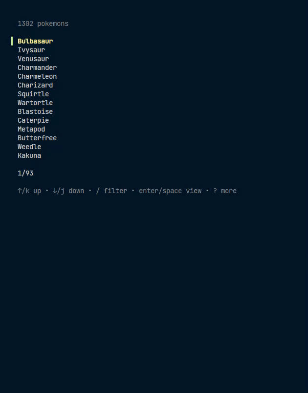

## What?

A Pokedex inspired Terminal UI Pokedex

## Why?

To make myself familiar with go's syntax and way of doing things.

## Libraries Used
- [bubbletea](https://github.com/charmbracelet/bubbletea)
- [lipgloss](https://github.com/charmbracelet/lipgloss)

## Preview

